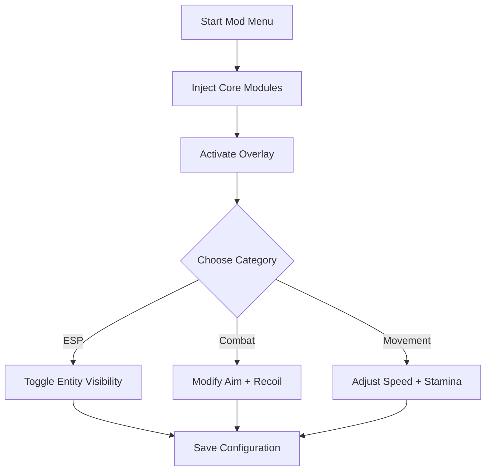

# Everwind Mod Menu 🌪

**Everwind Mod Menu** is an advanced control hub designed to give you complete flexibility inside *Everwind*.
From ESP overlays to gameplay modifiers and stat tuning, this all-in-one interface delivers smooth, adaptive, and intelligent control over every aspect of your experience.

Built for both casual explorers and veteran adventurers, it’s your key to mastering combat, movement, and loot management — all from a single, stylish interface.

---

## ⚙️ Overview

Unlike traditional trainers, **Everwind Mod Menu** integrates directly with the Everwind client, giving you **real-time feature toggling** and **mod stacking**.
Every parameter — from aim smoothing to loot visibility — is customizable through a simple GUI, meaning no restarts, no reloads, and no lag.

---

## 🧭 Core Features

### 👁 ESP & Awareness Controls

* **Player ESP:** See enemies and allies through terrain.
* **Loot Highlights:** Auto-color by rarity (Common, Rare, Epic).
* **Trap Detection:** Highlights mines and hazards in red.
* **Distance Scaling:** Dynamic fade for distant targets.

### 🎯 Combat & Aim Modules

* **Smart Aim Assist:** Calculates trajectory based on weapon speed.
* **FOV Adjuster:** Set your field of view dynamically in-game.
* **Hitbox Prioritization:** Target head, chest, or nearest limb.
* **Recoil Balance:** Remove weapon sway for consistent accuracy.

### ⚡ Movement & Performance Boosters

* **Unlimited Stamina** toggle.
* **Speed Control** (0.8x–2.0x range).
* **Fall Damage Reduction** for safe traversal.
* **Auto-Sprint Mode** for long-distance travel.

> [!NOTE]
> All modules can be bound to individual hotkeys or UI toggles — giving you total flexibility during gameplay.

---

## 💻 Compatibility

| Platform   | Supported | Details                   |
| ---------- | --------- | ------------------------- |
| Windows 10 | ✅         | Stable DX11 support       |
| Windows 11 | ✅         | Fully optimized           |
| Steam      | ✅         | Auto-hook with launcher   |
| Epic Games | ⚙️        | Manual injection required |

> [!IMPORTANT]
> Disable in-game motion blur for crisp ESP visuals and accurate overlay scaling.

---

## ⚙️ Setup Instructions

1. **Extract** the archive into your Everwind directory.
2. **Run** `Everwind_ModMenu.exe` as administrator.
3. Wait for the confirmation:

   ```
   [Everwind Mod Menu] Loaded successfully.
   ```
4. Launch *Everwind* normally.
5. Press `F8` to open the Mod Menu overlay.
6. Enable or disable modules via the tabs: **ESP**, **Combat**, **Movement**, **Visuals**.

---

### 🧩 Interface Diagram (Mermaid)



---

## 🧠 Configuration Example

```ini
[esp]
show_players=true
show_loot=true
trap_alert=true
range=900

[combat]
auto_aim=true
smoothness=0.7
recoil_reduction=true
fov=65

[movement]
speed=1.3
stamina_unlimited=true
```

> [!WARNING]
> Avoid using **Auto-Aim** and **Speed > 1.6x** simultaneously during online sessions — it may cause synchronization issues.

---

## ❓ FAQ

**Q1: Can I use Everwind Mod Menu offline?**
A: Yes — all functions work in offline or LAN modes.

**Q2: Does it modify save files?**
A: No, it only operates in runtime memory and resets after exiting.

**Q3: Can I customize hotkeys?**
A: Absolutely — edit `keybinds.cfg` for complete control.

**Q4: How often is it updated?**
A: Within 24 hours of each new Everwind patch.

**Q5: Does the Mod Menu reduce FPS?**
A: No measurable loss (<2%) even with all modules active.

---

## ⚡ Command-Line Presets

```bash
Everwind_ModMenu.exe --preset=explore.cfg
Everwind_ModMenu.exe --preset=pvp.cfg
Everwind_ModMenu.exe --safe
```

* `--preset` = load configuration instantly.
* `--safe` = uses minimal injection for max stability.

> [!NOTE]
> “Safe Mode” is recommended for users running overlay-heavy setups or streaming.

---

## 🌪 Pro Tips

* Use **ESP range 800–900** for balanced visibility.
* Combine **Auto-Sprint** and **Recoil Balance** for smooth combat movement.
* Save distinct profiles: *Explorer.cfg*, *Duelist.cfg*, *Boss.cfg* for quick swapping.
* For night maps, enable **High-Contrast Visuals** under “Display Options.”

---

## 🏁 Final Thoughts

The **Everwind Mod Menu** offers unparalleled freedom — customize, experiment, and dominate every corner of the Everwind world with precision and style.
From ESP overlays to advanced combat tweaks, it’s the essential all-in-one control suite for those who refuse to play on default settings.
